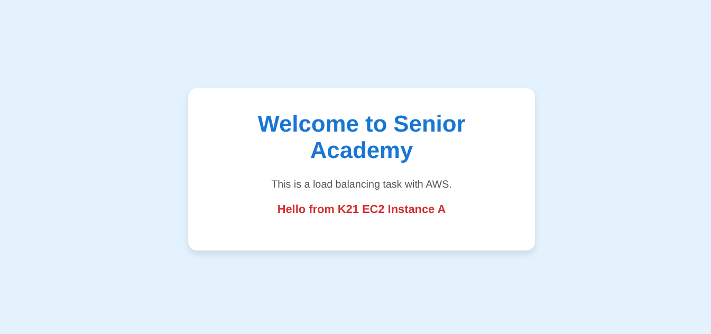
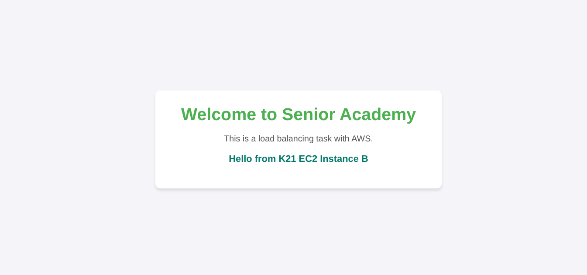

# 🚀 Deploying EC2 Instances Behind an Application Load Balancer

> A project demonstrating how to build a high-availability, fault-tolerant web infrastructure on AWS. This setup uses a VPC, private/public subnets, EC2 instances, and an Application Load Balancer (ALB) to distribute traffic evenly across instances in multiple Availability Zones (AZs).

---

## 🛠️ Key Technologies
* **AWS VPC:** Virtual Private Cloud
* **AWS EC2:** Elastic Compute Cloud
* **AWS ALB:** Application Load Balancer
* **AWS Security Groups:** Virtual Firewalls
* **Apache/Nginx:** Web Server

---

## ⚙️ Setup Process

### 1. Creating the VPC
* A new **VPC** was created to provide an isolated network environment.
* The VPC was configured with subnets spanning **Multiple Availability Zones (AZs)** for high availability.
* **Route Tables** were set up to control traffic flow between subnets.

### 2. Setting Up Subnets
* **Public Subnets** were created in two different Availability Zones (e.g., `us-east-1a` and `us-east-1b`).
* Route Tables for public subnets were configured with a route to an **Internet Gateway** (`0.0.0.0/0 -> igw-id`) to allow internet access.

### 3. Creating Security Groups
Two main security groups were established:

* **ALB Security Group (`sg-alb`)**:
    * **Inbound:** Allowed HTTP traffic on `Port 80` from all sources (`0.0.0.0/0`).
    * **Outbound:** Allowed all traffic.

* **EC2 Instance Security Group (`sg-ec2`)**:
    * **Inbound (HTTP):** Allowed traffic on `Port 80` **only** from the `sg-alb` security group. This ensures all web traffic comes through the load balancer.
    * **Inbound (SSH):** Allowed traffic on `Port 22` **only** from a specific IP (e.g., `My IP`) for secure management.

### 4. Setting Up EC2 Instances
* Launched two **EC2 Instances** (e.g., t2.micro) and placed one in each public subnet (AZ-1 and AZ-2).
* Installed **Apache** (or Nginx) on each instance to serve a simple web page.
* Ensured the web server was running and accessible on `Port 80`.

### 5. Creating the Application Load Balancer (ALB)
* An **Application Load Balancer** was created, configured to be internet-facing.
* It was mapped to the public subnets in both AZ-1 and AZ-2.
* A **Listener** was configured for `HTTP` on `Port 80`, forwarding traffic to a new Target Group.

### 6. Creating the Target Group
* A **Target Group** was created for the EC2 instances.
* **Protocol:** `HTTP`
* **Port:** `80`
* **Health Checks:** Configured to check the `HTTP` path `/` (the root of the website) on `Port 80`.
* Both EC2 instances were registered as targets.

### 7. Testing Traffic Distribution
* The ALB provides a single DNS endpoint (e.g., `my-alb-dns-name.us-east-1.elb.amazonaws.com`).
* Accessing this URL in a browser multiple times confirms that the load balancer is distributing traffic. As shown below, refreshing the page routes the request to a different instance each time.

**Request 1: Served by Instance A**

**Request 2 (after refresh): Served by Instance B**

### 8. Final Submission
* Verified that the **Target Group** health checks were passing for both instances.
* Tested fault tolerance by stopping one instance and confirming that all traffic was automatically routed to the remaining healthy instance.

---

## ✅ Results
* **High Availability:** The load balancer successfully distributed traffic across EC2 instances in multiple AZs.
* **Fault Tolerance:** The application remains available even if one EC2 instance or an entire Availability Zone fails.
* **Security:** EC2 instances are not directly exposed to the internet on `Port 80`; all web traffic is securely proxied through the ALB.
* **Health Checks:** Only healthy instances receive traffic, preventing users from encountering errors.

---

## 💡 Challenges and Solutions

### Health Check Issue
* **Challenge:** Initially, the instances were failing their health checks and being marked as "unhealthy" by the Target Group.
* **Solution:** This was resolved by ensuring the **Health Check Path** (`/`) in the Target Group settings correctly matched a valid page on the Apache server. In this case, the default `index.html` page satisfied the check. It's also crucial to ensure the `sg-ec2` security group allows traffic from the ALB.
