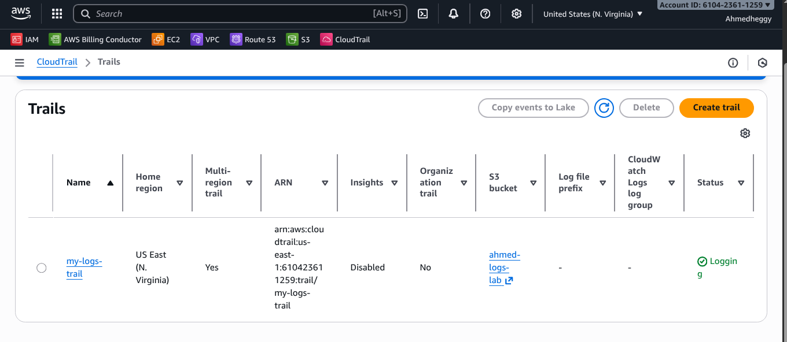
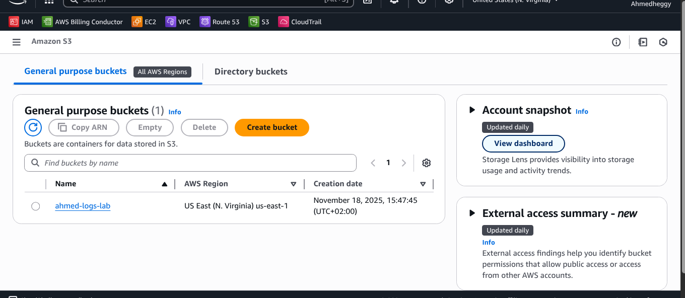
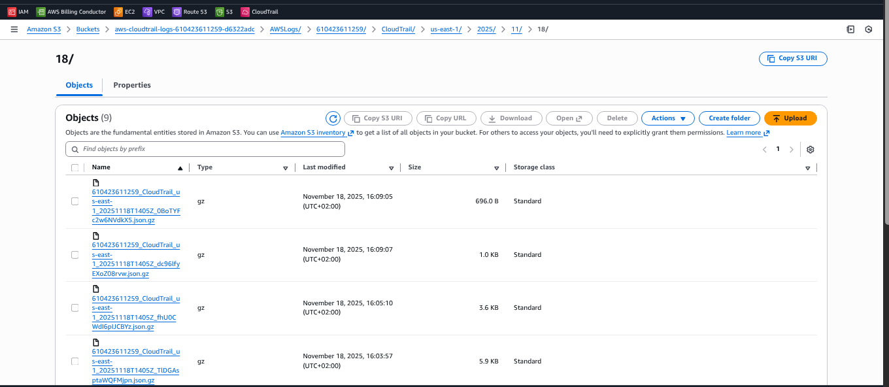
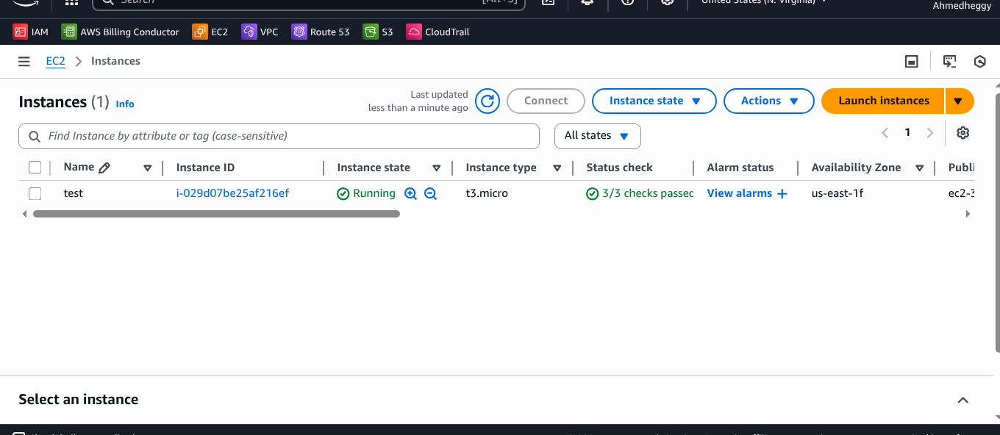
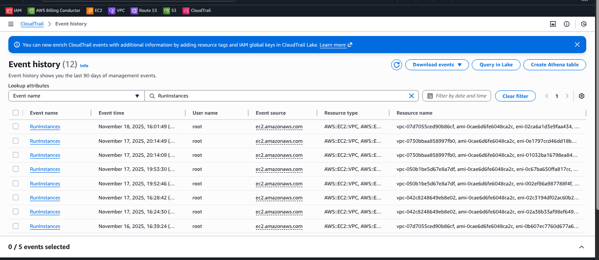

# AWS Audit and Compliance Lab: CloudTrail Integration with S3

## Project Overview
Objective is to create a CloudTrail trail to monitor account activities (API calls) and integrate it with an Amazon S3 bucket for long-term log retention. To validate the system, an EC2 instance is launched to generate a specific event (`RunInstances`), which is then traced and verified within the stored logs.

## Architecture
1. **Amazon S3:** Serves as the secure storage destination for audit logs.
2. **AWS CloudTrail:** Monitors and records account activity and API usage.
3. **Amazon EC2:** Acts as the resource to generate the "Management Event" for verification.

---

## Implementation Steps

### Step 1: Create S3 Bucket (Log Storage)
* Created a general-purpose S3 bucket with "Block Public Access" enabled to secure the audit logs.
* Configured server-side encryption (SSE-S3).

### Step 2: Configure CloudTrail (The Auditor)
* Created a new Trail named `my-logs-trail`.
* Configured the trail to deliver logs to the created S3 bucket.
* Enabled logging for **Management Events** (Read/Write) to capture API activities.

### Step 3: Generate Activity (Launch EC2 Instance)
* Launched a `t3.micro` EC2 instance named `test`.
* This action triggers the `RunInstances` API call, which CloudTrail captures.

### Step 4: Verification and Log Analysis
* Verified that the trail status is "Logging".
* Accessed the S3 bucket and navigated through the date-stamped folders.
* Located the `.json.gz` log files containing the event details.
* Confirmed the event in the CloudTrail Event History.

---

## Project Verification (Screenshots)

### 1. CloudTrail Configuration

### 2. S3 Bucket Overview

### 3. Log Files Integration

### 4. EC2 Instance

### 5. Event History Confirmation

---

## Resource Cleanup
To ensure no unintended costs occurred after the lab:
1. The EC2 instance was terminated.
2. The CloudTrail trail was stopped and deleted.
3. The S3 bucket was emptied and deleted.