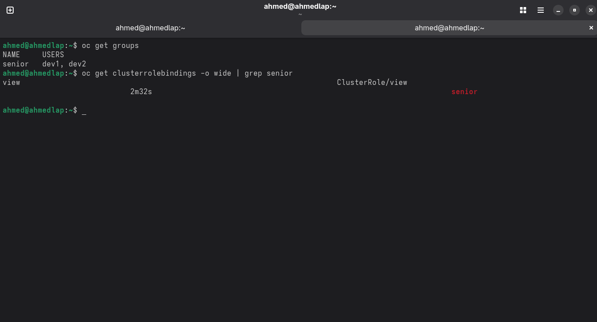

# OpenShift Group and Role Configuration

## Overview
Create A Group with users & Assign view role 

## Group Configuration

### Senior Group
- **Group Name:** `senior`
- **Group Members:** `dev1`, `dev2`

### Role Assignment
The `senior` group has been assigned the `view` ClusterRole through a ClusterRoleBinding, granting read-only access to cluster resources.

**Cluster Role Binding Details:**
- **Role:** `view` (ClusterRole)
- **Bound To:** `senior` group
- **Access Level:** Read-only permissions across the cluster

## User Authentication

### Verified User Accounts
Two user accounts have been successfully authenticated:

1. **User:** `dev1`
   - Status: Login successful
   - Default project: "default"

2. **User:** `dev2`
   - Status: Login successful
   - Default project: "default"

## Access Summary

### Permissions Granted
Users in the `senior` group (`dev1` and `dev2`) have:
- Read-only access to cluster resources
- Ability to view but not modify cluster objects
- Access to the "default" project
- Successful authentication capabilities

### Security Context
- Role-based access control (RBAC) properly implemented
- Group-level permissions instead of individual user assignments
- Appropriate segregation of duties with view-only privileges

## Configuration Status
✅ Group `senior` created with members dev1 and dev2 
✅ ClusterRoleBinding established for view permissions 
✅ User authentication verified for both group members 
✅ Default project access confirmed

### Results

