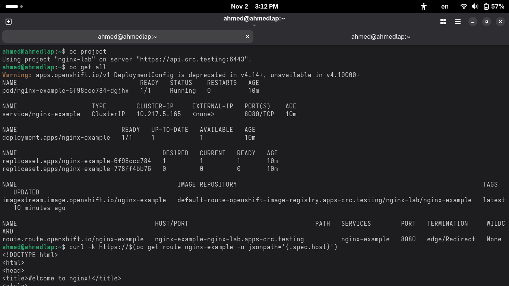
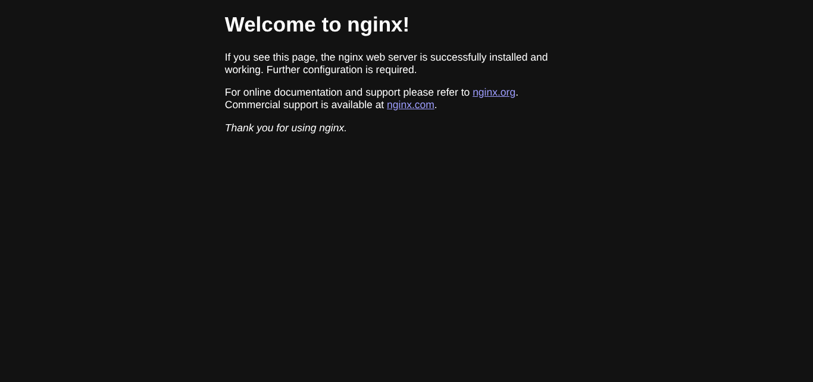

# Lab: Deploy Nginx with HTTPS on OpenShift

## Objective
Set up a simple Nginx web server inside OpenShift using CLI commands with HTTPS enabled. The goal is to understand how to:
- Create and manage OpenShift projects
- Apply Security Context Constraints (SCC)
- Deploy a containerized Nginx app
- Expose the service with TLS (edge termination)

## Environment Requirements
- OpenShift cluster (local CRC or remote)
- oc CLI tool installed and configured
- Cluster-admin or project admin privileges

## Lab Steps

### Step 1 — Create New Project
Create a new OpenShift project for the lab.

### Step 2 — Apply Security Policy (SCC anyuid)
Assign the anyuid SCC policy to the new project to allow Nginx to run with proper permissions.

### Step 3 — Deploy Nginx Application
Deploy the Nginx container image as an application inside the project.

### Step 4 — Create HTTPS Route
Expose the deployed Nginx service using an HTTPS route with edge termination.

### Step 5 — Verify Resources
List and confirm all resources created by the deployment including pods, services, and routes.

### Step 6 — Test Application
Access the HTTPS route in a browser or CLI to verify application availability and HTTPS functionality.

### Step 7 — Verify Pods
Confirm that the Nginx Pod is running and serving traffic properly by checking pod status and logs.

## Deliverables
Participants should provide:
- Project/namespace name used for the deployment
- All CLI commands used during the lab
- Outputs of verification commands
- Screenshot of the Nginx HTTPS web page accessed through a browser

## Notes
- Use a self-signed certificate for HTTPS testing (common in CRC/OpenShift local setups)
- If Pods are not running, recheck image pull policy and SCC permissions
- Optional: Extend the lab by creating a ConfigMap to customize the default Nginx page

## Expected Outcome
Upon completion, learners will understand how to:
- Deploy a basic Nginx application in OpenShift
- Apply SCC permissions for container security
- Expose the application securely over HTTPS with proper TLS termination
- Verify and troubleshoot OpenShift deployments

## Expected Results

