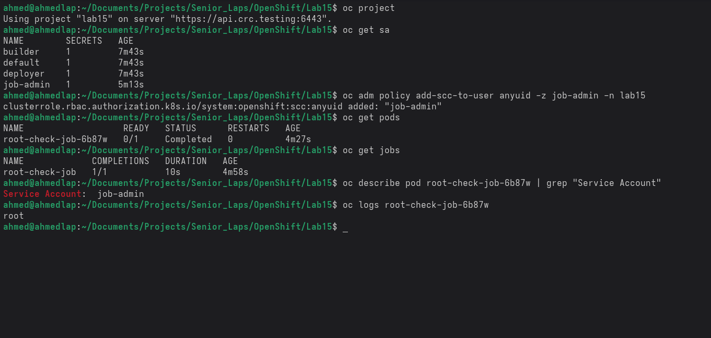

# OpenShift Lab: One-Time Job with Elevated Privileges

## Lab Objectives
- Create and manage OpenShift projects.
- Use custom ServiceAccounts for Job execution.
- Assign elevated privileges using anyuid Security Context Constraint (SCC).
- Run one-time Jobs with root access.
- Verify Job execution and permissions.
- Clean up OpenShift resources after Job completion.

## Lab Scenario
As a DevOps Engineer, you need to run a one-time system check Job inside OpenShift.
The Job must execute a simple system command that requires **root privileges**.

By default, OpenShift prevents containers from running as root.
In this lab, you will:
1. Create a custom ServiceAccount.
2. Grant it elevated privileges using anyuid SCC.
3. Run a one-time Job using that ServiceAccount.
4. Verify that the Job executed successfully with root access.
5. Clean up the resources.

## Lab Results
After running the Job, verify the following:
- The Job completed successfully.
- The Pod used the correct ServiceAccount.
- The container ran with root permissions.

## Cleanup
After verification, make sure to remove all resources created during this lab to keep your environment clean
